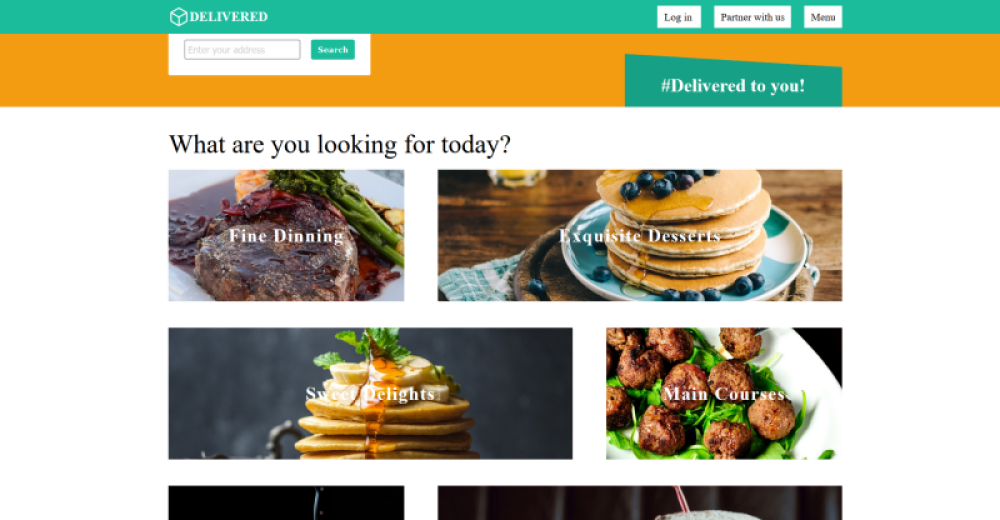

# Delivered
> Delivered is a example food ordering app built with React and Sass 

## Table of contents
* [Screenshots](#screenshots)
* [Technologies](#technologies)
* [Setup](#setup)
* [Status](#status)
* [Inspiration](#inspiration)
* [Contact](#contact)

## Screenshots


## Technologies
* HTML5/CSS3
* SASS - version 1.26
* React - 16.3
* Webpack - 4.44

## Setup
To run this project, install it locally using npm:

```
$ npm install
$ npm devstartstart
```

## Status
Project is: in progress

## Inspiration
Project inspired by Deliveroo

## Contact
Created by Miroslav Tetevenski. Feel free to contact me @ miroslav.tetevenski@gmail.com